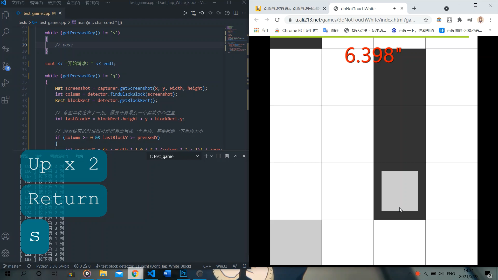

# Don't Tap White Block
A physical plug-in of game "*Don't Tap White Block*" based on OpenCV and Arduino Uno R3.

## Hardware
### Hardware inventory
* USB camera × 1
* Arduino Uno R3 × 2
* L298N driving board × 4
* 12v1a power adapter × 4
* HC-05 Bluetooth module × 2
* 42BYGH34S stepper motor × 4
### Minimum hardware connection


## Mobile game
### Start game
```shell
make
.\build\dont_tap_white_block
```
### Screenshot


## Computer game
### Start game
```shell
make pc_game
.\build\pc_game
```
### Screenshot


## Notes
1. Your OpenCV bin folder path and include folder path may be different from mine, so please change `opencv_include_dir` and `opencv_bin_dir` in Makefile to your folder path before make.
2. Your two Bluetooth COM numbers may be different from mine, please check COM number for HC-05 through **Control panel -> View devices and printers**. Then you can specify two COM numbers with the following code, where COM1 and COM2 are serial port numbers of two HC-05 respectively.
    ```shell
    .\build\dont_tap_white_block COM1 COM2
    ```


## License
```
MIT License

Copyright (c) 2021 Huang Zhengzhi, Ouyang Xianzheng

Permission is hereby granted, free of charge, to any person obtaining a copy
of this software and associated documentation files (the "Software"), to deal
in the Software without restriction, including without limitation the rights
to use, copy, modify, merge, publish, distribute, sublicense, and/or sell
copies of the Software, and to permit persons to whom the Software is
furnished to do so, subject to the following conditions:

The above copyright notice and this permission notice shall be included in all
copies or substantial portions of the Software.

THE SOFTWARE IS PROVIDED "AS IS", WITHOUT WARRANTY OF ANY KIND, EXPRESS OR
IMPLIED, INCLUDING BUT NOT LIMITED TO THE WARRANTIES OF MERCHANTABILITY,
FITNESS FOR A PARTICULAR PURPOSE AND NONINFRINGEMENT. IN NO EVENT SHALL THE
AUTHORS OR COPYRIGHT HOLDERS BE LIABLE FOR ANY CLAIM, DAMAGES OR OTHER
LIABILITY, WHETHER IN AN ACTION OF CONTRACT, TORT OR OTHERWISE, ARISING FROM,
OUT OF OR IN CONNECTION WITH THE SOFTWARE OR THE USE OR OTHER DEALINGS IN THE
SOFTWARE.
```