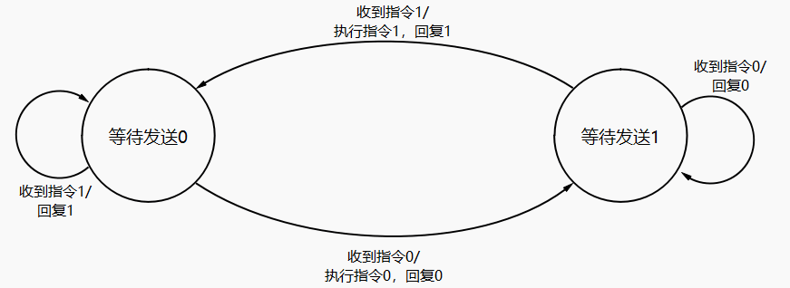

# Control algorithm
There may be packet loss in Bluetooth wireless communication, including failure to receive the instructions from the sender and failure to reply to the sender that it has completed the instructions. So we use two finite state machines to ensure reliable data transmission and orderly motor control.

# State Machines
## Sender

## Receiver
